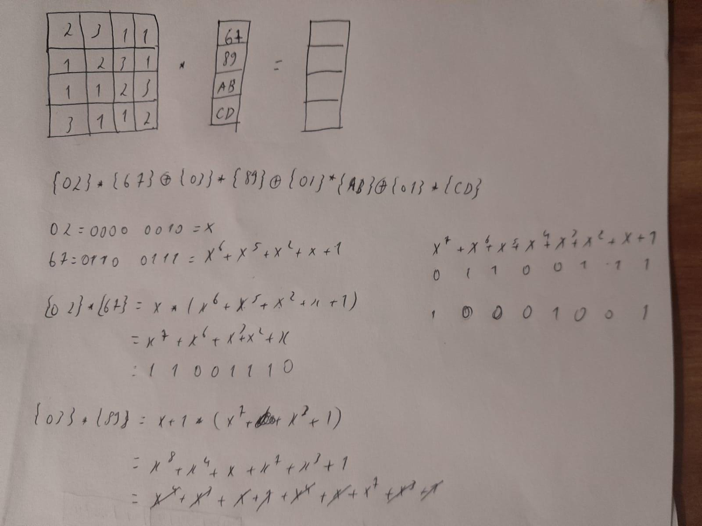

### 1. Para cada um dos seguintes recursos, determine um nível de impacto baixo, moderado ou alto à perda de confidencialidade, disponibilidade e integridade, respectivamente. Justifique suas respostas.
##### (a) uma organização gerenciando informações públicas em seu servidor web.
Baixo.
##### (b) uma organização de aplicação da lei gerindo informações de investigação extremamente sensíveis.
Alto.
##### (c) uma organização financeira gerindo informações administrativas rotineiras (sem informações relacionadas à privacidade).
Baixo.
##### (d) um sistema de informação utilizado para grandes aquisições em uma organização voltada a contratações que contém dados sensíveis da fase de pré-solicitação e dados administrativos rotineiros. avalie o impacto de haver dois conjuntos de dados separadamente e o sistema de informação único.
Moderado. 
##### (e) uma indústria de energia contém um sistema SCada (controle supervisório e aquisição de dados, do acrônimo em inglês para supervisory control and data acquisition) controlando a distribuição da energia elétrica para uma grande instalação militar. o sistema SCada contém tanto sensores de dados em tempo real quanto informações das rotinas administrativas. avalie o impacto de haver dois conjuntos de dados separadamente e o sistema de informação único.
Alto

### 2. Responda, explique com exemplos, as questões abaixo:
##### (a) Quais são os elementos essenciais de uma cifra simétrica? Explique-as.
**Texto claro**: essa é a mensagem ou dados originais, inteligíveis, que servem como entrada do algoritmo
de encriptação.
**Algoritmo de encriptação**: realiza diversas substituições e transformações no texto claro.
**Chave secreta**: também é uma entrada para o algoritmo de encriptação. A chave é um valor independente do texto claro e do algoritmo. O algoritmo produzirá uma saída diferente, dependendo da chave usada no momento. As substituições e transformações exatas realizadas pelo algoritmo dependem da chave.
**Texto cifrado**: essa é a mensagem embaralhada, produzida como saída do algoritmo de encriptação. Ela depende do texto claro e da chave secreta. Para determinada mensagem, duas chaves diferentes produzirão dois textos cifrados distintos. O texto cifrado é um conjunto de dados aparentemente aleatório e,nesse formato, ininteligível.
**Algoritmo de decriptação**: esse é basicamente o algoritmo de encriptação executado de modo inverso. Ele apanha o texto cifrado e a chave secreta e produz o texto claro original.
##### (b) Quais são as duas funções básicas usadas nos algoritmos de encriptação? Explique-as.
Todos os algoritmos de encriptação são baseados em dois princípios gerais:substituição, em que cada elemento no texto claro (bit,letra, grupo de bits ou letras) é mapeado em outro elemento, e transposição, em que os elementos no texto claro são rearranjados.
##### (c) Quantas chaves são necessárias para duas pessoas se comunicarem por meio de uma cifra? Explique-as, demonstrando, você pode se utilizar de gráficos ou desenhos.
Se tanto o emissor quanto o receptor utilizarem a mesma chave, o sistema é considerado de encriptação simétrica, de chave única, de chave secreta ou convencional. Se emissor e receptor usarem chaves diferentes, o sistema é considerado de encriptação assimétrica, de duas chaves
ou de chave pública.
##### ((d) Quais são as duas técnicas gerais para atacar uma cifra? Explique-as.
**Criptoanálise:** os ataques criptoanalíticos utilizam-se da natureza do algoritmo, e talvez de mais algum
conhecimento das características comuns ao texto claro, ou ainda de algumas amostras de pares de texto
claro-texto cifrado. Esse tipo de ataque explora as características do algoritmo para tentar deduzir um
texto claro específico ou a chave utilizada.
**Ataque por força bruta:** o atacante testa todas as chaves possíveis em um trecho do texto cifrado, até
obter uma tradução inteligível para o texto claro. Na média, metade de todas as chaves possíveis preci-
sam ser experimentadas para então se obter sucesso.
##### (e) Defina resumidamente a cifra de César; a cifra de Hill; a cifra de Feistel (por que é importante estudá-la?); e, a diferença entre DES, Rijndael e AES.
**cifra de César** envolve substituir cada letra do alfabeto por aquela que fica três posições adiante.
**cifra de Hill** Esse algoritmo de encriptação utiliza m letras de texto claro sucessivas e as substitui por m letras de texto cifrado. A substituição é determinada por m equações lineares, em que cada caractere recebe um valor numérico (a = 0, b = 1, ..., z = 25)
**cifra de Feistel** Muitos algoritmos de encriptação de bloco simétricos em uso atual são baseados em uma estrutura conhecida como cifra de bloco de Feistel Feistel propôs que podemos aproximar a cifra de bloco ideal utilizando o conceito de uma cifra de produto, que é a execução de duas ou mais cifras simples em sequência, de tal forma que o resultado ou produto final seja criptograficamente mais forte do que qualquer uma das cifras componentes.

### 3. Quando o barco de patrulha norte-americano PT-109, sob o comando do tenente John f. Kennedy, foi afundado por um destróier japonês, uma mensagem foi recebida na estação sem fio australiana em código playfair:
### KXJEY UREBE ZWEHE WRYTU HEYFS
### KREHE GOYFI WTTTU OLKSY CAJPO
### BOTEI ZONTX BYBNT GONEY CUZWR
### GDSON SXBOU YWRHE BAAHY USEDQ
### a chave usada foi royal new zealand navy. decripte a mensagem. traduza TT para tt.

### 4. Crie uma aplicação que possa encriptar e decriptar usando uma cifra de Hill 2 × 2.

### 5. Responda, resumidamente, as questões a seguir:
##### (a) Qual é a diferença entre uma cifra de bloco e uma cifra de fluxo?
Uma cifra de fluxo é aquela que encripta um fluxo de dados digital um bit ou um byte por vez.
Uma cifra de bloco é aquela em que um bloco de texto claro é tratado como um todo e usado para produzir
um de texto cifrado com o mesmo tamanho.
##### (b) O que é uma cifra de produto?
Cifras de produto iteradas realizam encriptação em várias rodadas, cada uma das quais utiliza uma subchave diferente derivada da chave original.
##### (c) Qual é a diferença entre difusão e confusão? Explique.
Na difusão, a estrutura estatística do texto claro é dissipada em estatísticas de
longa duração do texto cifrado.
a confusão procura estabelecer o relacionamento entre as estatísticas do texto cifrado e o valor
da chave de encriptação o mais complexo possível
##### (d) Quais parâmetros e escolhas de projeto determinam o algoritmo real de uma cifra de Feistel?
Tamanho de bloco: tamanhos de bloco maiores significam maior segurança (mantendo as outras coisas
iguais), mas velocidade de encriptação/decriptação reduzida para determinado algoritmo. Maior segu-
rança é obtida por difusões maiores. Tradicionalmente, o tamanho de bloco de 64 bits foi considerado
uma escolha razoável e quase universal no projeto de cifras de bloco. Porém, o novo AES usa um tama-
nho de bloco de 128 bits.
Tamanho de chave: tamanho de chave maior significa maior segurança, mas pode diminuir a velocidade
de encriptação/decriptação. Maior segurança é obtida pela maior resistência a ataques de força bruta
e maior confusão. Os tamanhos de chave de 64 bits ou menos agora são em grande parte considerados
inadequados, e 128 bits tornou-se um padrão comum.
Número de rodadas: a essência da cifra de Feistel é que uma única rodada oferece segurança inade-
quada, mas várias proporcionam maior segurança. Um tamanho típico é de 16 rodadas.
Algoritmo de geração de subchave: maior complexidade nesse algoritmo deverá levar a maior dificul-
dade de criptoanálise.
Função F: novamente, maior complexidade geralmente significa maior resistência à criptoanálise.
Existem duas outras considerações no projeto de uma cifra de Feistel:
Encriptação/decriptação rápidas em software: em muitos casos, a encriptação é embutida nas aplicações
ou funções utilitárias, de tal forma que impede uma implementação em hardware. Por conseguinte, a
velocidade de execução do algoritmo torna-se uma preocupação.
Facilidade de análise: embora quiséssemos tornar nosso algoritmo o mais difícil possível de criptoanali-
sar, existe um grande benefício em colocá-lo como fácil de ser analisado. Ou seja, se o algoritmo puder
ser explicado de forma concisa e clara, é mais fácil analisá-lo em busca de vulnerabilidades criptoanalí-
ticas e, portanto, desenvolver um nível mais alto de garantia quanto a sua força. DES, por exemplo, não
tem uma funcionalidade facilmente analisável.
##### (e) Explique o efeito avalanche.
Uma propriedade desejável de qualquer algoritmo de encriptação é que uma pequena mudança no texto
claro ou na chave produza uma alteração significativa no texto cifrado.

### 6. Encontre o inverso multiplicativo de cada elemento diferente de zero em Z5:
1-1 $\equiv 1  (\mod{5})$
2-1 $\equiv 3  (\mod{5})$
3-1 $\equiv 2  (\mod{5})$
4-1 $\equiv 4  (\mod{5})$

### 7. Para a aritmética de polinômios com coeficientes em Z10, realize os seguintes cálculos:

##### 1. $(7x + 2) − (x^2 + 5)$
##### 2. $(6x^2 + x + 3) × (5x^2 + 2)$

### 8. Use a chave 1010 0111 0011 1011 para encriptar o texto claro "ok" conforme expresso em ASCII, ou seja, 0110 1111 0110 1011. Os projetistas do S-AES obtiveram o texto cifrado 0000 0111 0011 1000. E você?

1110110111101101

### 9. Compare AES com DES. Para cada um dos seguintes elementos do DES, indique o elemento comparável no AES ou explique por que ele não é necessário no AES.
### (a) XOR do material da subchave com a entrada da função f.
Tranformações de cada rodada
### (b) XOR da saída da função f com a metade esquerda do bloco.
AddRoundKey
### (c) função f.

### (d) permutação P.
ShiftRows
### (e) troca de metades do bloco.
O AES não precisa fazer a troca de metade por que processa o bloco de dados inteiro como uma única matriz.

### 10. Calcule a saída da transformação MixColumns para a seguinte sequência de bytes de entrada "67 89 AB CD". Aplique a transformação InvMixColumns ao resultado obtido para verificar seus cálculos. Altere o primeiro byte da entrada de "67"para "77", realize a transformação MixColumns novamente para a nova entrada e determine quantos bits mudaram na saída. Nota: você pode realizar todos os cálculos à mão ou escrever um programa que dê suporte a eles. Se escolher escrever um programa, ele deverá ser feito inteiramente por você; nesta tarefa, não use bibliotecas ou código fonte de domínio público (você pode se guiar pelos exemplos Sage disponibilizados).

### 11. (2 pontos-extra) Crie um software que possa encriptar e decriptar usando S-AES. Dados de teste: um texto claro binário de 0110 1111 0110 1011 encriptado com uma chave binária de 1010 0111 0011 1011 deverá dar o texto cifrado binário 0000 0111 0011 1000. A decriptação deverá funcionar da mesma forma.